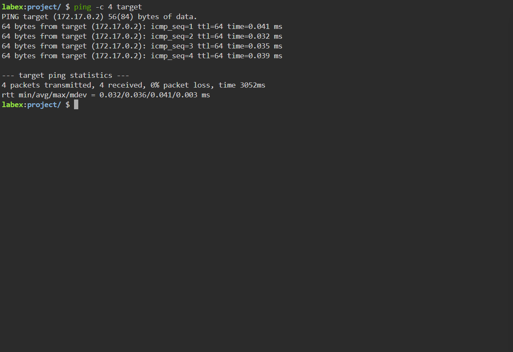
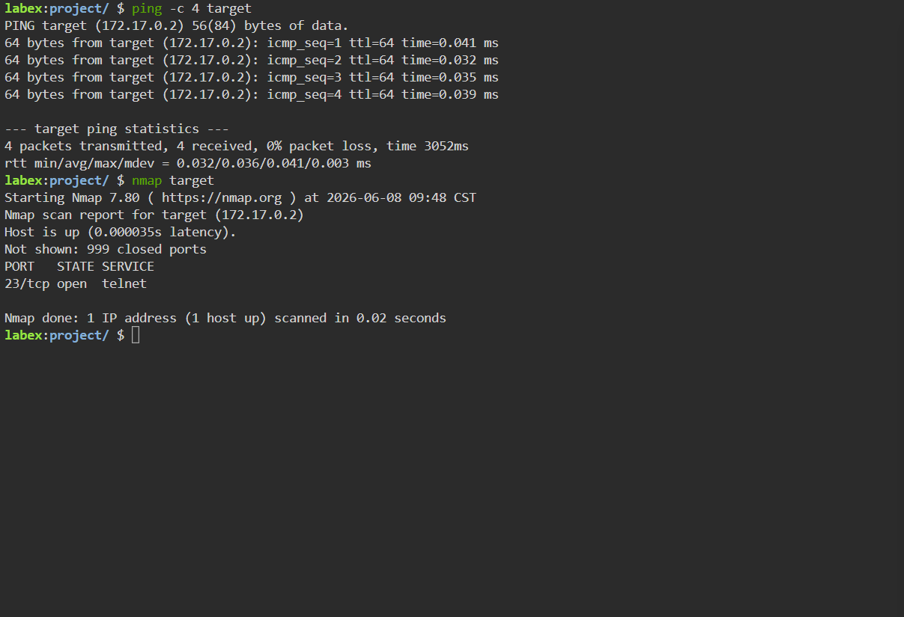
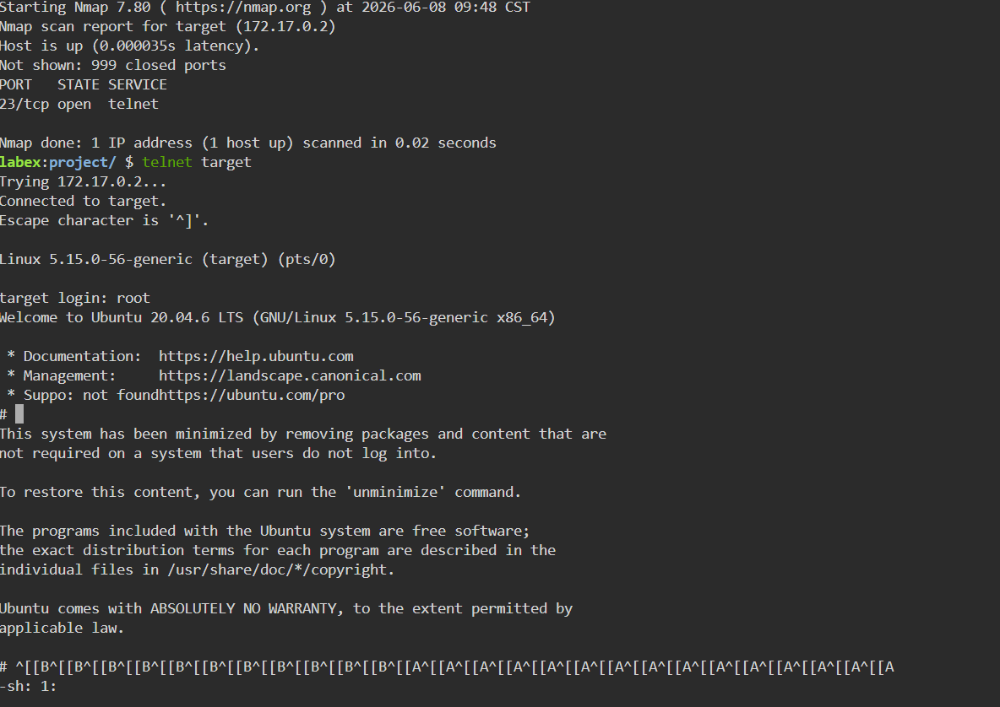
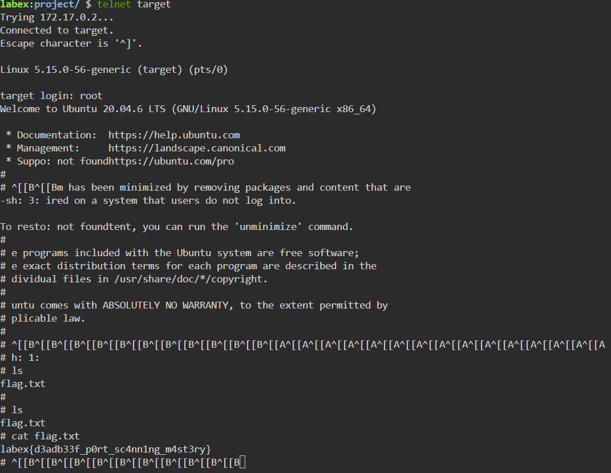

# Project – Network Reconnaissance & Service Exploitation with Nmap and Telnet


---

## Overview

This project demonstrates a fundamental **network reconnaissance and service exploitation workflow** using **Nmap** and **Telnet** on a live target host inside the **LabEx** lab environment. Starting from a blank terminal, the target machine was discovered, scanned for open ports and services, accessed via an exposed Telnet service, and a flag was captured — completing the challenge.

This lab maps directly to real-world skills used in **penetration testing**, **red team operations**, **SOC analysis**, and **CTF (Capture the Flag)** competitions.

---

## Environment

| Tool | Purpose |
|------|---------|
| LabEx (labex.io) | Browser-based Linux lab environment |
| Nmap 7.80 | Network port scanner and service identifier |
| Telnet | Remote terminal connection to target host |
| `ping` | Host discovery and connectivity verification |
| Target Host | `172.17.0.2` (hostname: `target`) |

---

## Attack Chain Summary

```
Ping → Confirm host is alive
  ↓
Nmap → Scan for open ports → Port 23/tcp (Telnet) found open
  ↓
Telnet → Connect to target → Login as root
  ↓
ls → Discover flag.txt
  ↓
cat flag.txt → Capture the flag
```

---

## Step-by-Step Walkthrough

---

### Step 1 – Host Discovery with Ping

Before scanning, the target was confirmed to be alive and reachable using `ping -c 4 target`. All 4 packets returned successfully with 0% packet loss and sub-millisecond latency, confirming the host is up.

```bash
ping -c 4 target
```

**Result:** 4 packets transmitted, 4 received, 0% packet loss. RTT avg: 0.036ms.


*Terminal — ping confirms target (172.17.0.2) is alive with 0% packet loss and consistent response times*

---

### Step 2 – Port Scan with Nmap

With the host confirmed alive, Nmap was run against the target to identify open ports and running services.

```bash
nmap target
```

**Result:** Port `23/tcp` was found **open**, running the **Telnet** service. All other 999 ports were closed.

> **Why this matters:** Telnet is an unencrypted, legacy remote access protocol. An open Telnet port on any system is a significant security finding — it allows remote login and transmits credentials in plaintext, making it easily interceptable.


*Terminal — ping output followed immediately by Nmap scan; Port 23/tcp open (Telnet) identified on 172.17.0.2*

---

### Step 3 – Telnet Access and Root Login

With port 23 confirmed open, a Telnet connection was initiated to the target. The service accepted a login as `root` with no password resistance, granting full shell access to the target system.

```bash
telnet target
```

**Result:** Successfully connected to `172.17.0.2`. Logged in as `root` on Ubuntu 20.04.6 LTS.

> **Why this matters:** A root-accessible Telnet service with no authentication hardening represents complete system compromise. In a real engagement, this would be a critical finding immediately escalated for remediation.


*Terminal — Nmap confirms Port 23/tcp open, Telnet connects to target, root login accepted on Ubuntu 20.04.6 LTS*

---

### Step 4 – Flag Discovery and Capture

Once inside the target system, the filesystem was explored and a flag file was identified and read.

```bash
ls
cat flag.txt
```

**Flag captured:**
```
labex{d3adb33f_p0rt_sc4nn1ng_m4st3ry}
```


*Terminal — ls reveals flag.txt on the target; cat flag.txt displays the captured flag*

---

## Key Concepts Demonstrated

| Concept | What Was Demonstrated |
|---------|----------------------|
| Host Discovery | Used `ping` to confirm target is reachable before scanning |
| Port Scanning | Used Nmap to identify open ports and services on the target |
| Service Identification | Nmap identified Port 23 as running Telnet (a legacy, insecure protocol) |
| Service Exploitation | Connected via Telnet and gained root shell access with no authentication barriers |
| Post-Exploitation | Navigated the filesystem, located, and exfiltrated the flag |
| Security Risk Identification | Telnet on port 23 = plaintext credentials, no encryption, full remote access risk |

---

## Skills Demonstrated

| Skill | How It Was Applied |
|-------|--------------------|
| Network Reconnaissance | Used `ping` and `nmap` to map the target before attempting access |
| Port Scanning with Nmap | Identified a single open port (23/tcp Telnet) among 1000 scanned |
| Telnet Remote Access | Connected to the target host via Telnet and authenticated as root |
| Linux Command Line | Used `ls` and `cat` to navigate and read files on the target system |
| CTF Methodology | Followed a full recon → exploit → post-exploit chain to capture the flag |
| Security Analysis | Identified why open Telnet is a critical vulnerability in real environments |

---

## Lessons Learned

**Nmap is the starting point for any network engagement.** Before touching a target, you need to know what's running. A single Nmap scan revealed the entire attack surface here — one open port, one exploitable service. In real environments, knowing what's exposed is 80% of the work.

**Open Telnet is a critical vulnerability.** Telnet was designed before security was a priority — it transmits everything in plaintext, including passwords. Any system with port 23 open and accessible is a serious finding. In enterprise environments, Telnet should be replaced with SSH universally.

**Root access without authentication is a complete compromise.** Getting a root shell via Telnet with no credential challenge means the attacker has full control of the system — they can read, write, delete, or exfiltrate anything. In a penetration test, this would be the highest severity finding on the report.

**The recon → access → post-exploit chain is universal.** Whether you're doing a CTF, a pentest, or a red team engagement, the methodology is the same: discover the host, identify the surface, exploit the weakness, achieve the objective. This lab is a clean, foundational example of that chain from start to finish.

---

## References

- [Nmap Official Documentation](https://nmap.org/docs.html)
- [LabEx Cybersecurity Labs](https://labex.io)
- [OWASP – Insecure Service Configuration](https://owasp.org/www-community/vulnerabilities/Insecure_Configuration_Management)
- [NIST – Telnet Security Guidance](https://csrc.nist.gov/)
